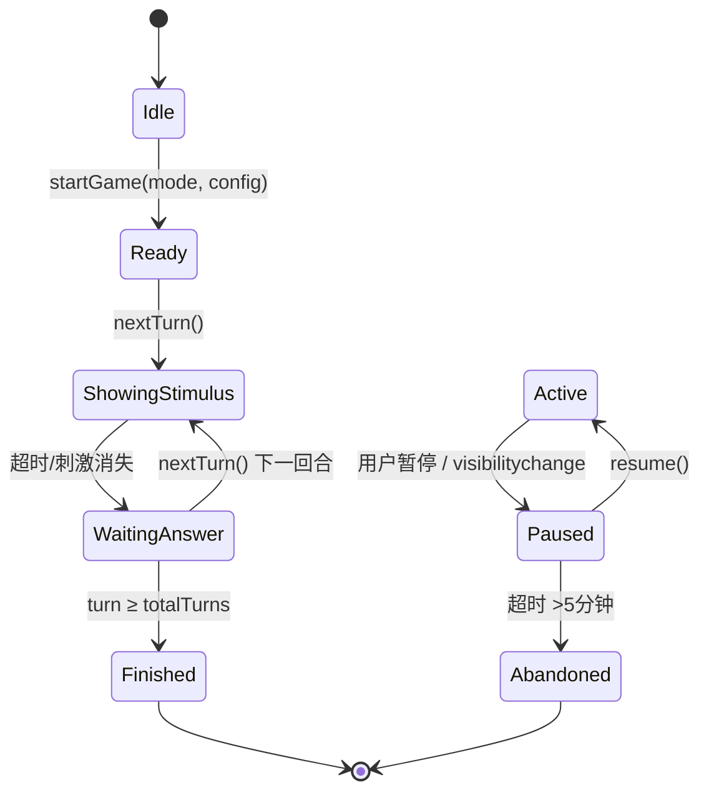

# 02 — 功能规格文档 (SPEC)

> 版本: v2.0
> 更新: 2026-06-26

---

## 1. 核心游戏系统

### 1.1 标准N-back

**描述**: 玩家观察依次呈现的刺激，判断当前刺激是否与N步前相同。

**配置参数**:
| 参数 | 类型 | 范围 | 默认值 | 说明 |
|------|------|------|--------|------|
| n | number | 1-5 | 1 | N-back的N值 |
| speed | number(ms) | 2000-5000 | 3500 | 刺激展示时长 |
| totalTurns | number | 10-50 | 15 | 总回合数 |
| matchProbability | number(0-1) | 0.2-0.5 | 0.4 | 匹配回合出现概率 |

**游戏流程**:
```
1. 初始化: history=[], turn=0, score=0
2. 生成刺激:
   - 如果 history.length >= n 且 Math.random() < matchProbability:
       current = history[length - n]  (目标刺激)
   - 否则:
       current = randomFactor(排除当前已生成刺激)
3. 展示刺激 showStimulus=true
4. 等待 speed ms 后隐藏 showStimulus=false
5. 等待 1s 过渡
6. 玩家可在此期间按下"似曾相识"按钮
7. 判断: 如果 history.length >= n:
      如果 current === history[length - n]:
         按了 → 正确 +1分
         没按 → 漏判 0分
      否则:
         按了 → 误判 0分
         没按 → 正确 0分
8. 重复2-7　　直到 turn >= totalTurns
```

**状态转换**:


**验收标准**:
- [ ] N=1, 2, 3 三种难度可正常运行
- [ ] 匹配概率约40%，误差 ≤5%
- [ ] 暖身期 (前N回合) 不出现匹配，按钮不可用
- [ ] 超时未作答视为漏判
- [ ] 暂停后恢复可继续游戏
- [ ] 分数计算正确 (仅正确命中+1分)
- [ ] 游戏结束后弹出结果页

---

### 1.2 双N-back

**描述**: 同时呈现视觉刺激和播放听觉刺激，玩家需分别判断两个通道是否匹配。

**与标准N-back的差异**:
| 属性 | 标准N-back | 双N-back |
|------|-----------|----------|
| 刺激 | 1个视觉 | 1个视觉 + 1个听觉 |
| 判分 | 1个答案 | 2个独立答案 (视觉+听觉) |
| 按钮 | 1个"似曾相识" | 2个按钮 (视觉匹配/听觉匹配) |
| 总分 | score | visualScore + audioScore |

**验收标准**:
- [ ] 视觉和听觉刺激同时呈现
- [ ] 两个匹配按钮独立工作
- [ ] 分别统计视觉和听觉得分
- [ ] 支持先显示视觉，延迟显示听觉 (可配置)

---

### 1.3 空间N-back

**描述**: 刺激在N个格子中的某个位置出现，判断当前位置是否与N步前相同。

**与标准N-back的差异**: 记忆因子从"是什么"变为"在哪里"。

**格子布局**:
- 2-back: 3×3 网格
- 3-back: 4×4 网格
- 高难度: 5×5 网格

**验收标准**:
- [ ] 刺激在格子间随机出现
- [ ] 位置判断逻辑正确
- [ ] 格子在移动端触摸友好 (≥44px)

---

### 1.4 栅格N-back (魔方模式)

**描述**: 逐格揭示一个N×N的图案面，判断整个面是否与之前一致。是空间+视觉的联合记忆。

**阶段递进**:
| 阶段 | 网格 | N值 | 描述 |
|------|------|-----|------|
| 1 | 1×1 | 1 | 等于标准N-back |
| 2 | 2×1 | 1 | 左右两格，追踪特定位置 |
| 3 | 2×2 | 1 | 4格整面匹配 |
| 4 | 3×3 | 1 | 9格整面匹配 |
| 5 | 2×2 | 2 | 4格 + 追踪2步前 |

**揭示动画**: 格子逐个翻出 (每个500ms)，全部揭示后进入判断阶段。

**验收标准**:
- [ ] 阶段1-3可正常运行
- [ ] 格子逐个揭示动画流畅
- [ ] 匹配/不匹配判断正确
- [ ] 移动端格子 ≥ 60px

---

## 2. 记忆因子系统

### 2.1 因子插件接口

```typescript
interface FactorPlugin {
  id: string;                    // 唯一标识
  name: string;                  // 显示名称
  type: 'visual' | 'audio' | 'mixed';
  pool: Factor[];                // 因子池
  render(factor: Factor): ReactNode;  // 渲染函数
  compare(a: Factor, b: Factor): boolean;  // 比较函数
  generate(): Factor;            // 生成随机因子
}
```

### 2.2 已规划因子

| ID | 名称 | 类型 | 版本 | 池大小 |
|----|------|------|------|--------|
| emoji-flower | 花朵Emoji | visual | v1.0 | 8 |
| emoji-animal | 动物Emoji | visual | v1.1 | 12 |
| emoji-food | 食物Emoji | visual | v1.1 | 12 |
| image-abstract | 抽象图片 | visual | v1.1 | 20 |
| text-zh | 中文双字词 | visual | v1.1 | 30 |
| text-en | 英文单词 | visual | v1.1 | 30 |
| symbol | 抽象符号 | visual | v1.1 | 16 |
| tone | 纯音音调 | audio | v1.1 | 8 |
| word-spoken | 语音单词 | audio | v1.1 | 20 |

### 2.3 因子注册流程

```javascript
// 新增因子只需注册，无需改引擎代码
FactorRegistry.register({
  id: 'emoji-flower',
  name: '花朵',
  type: 'visual',
  pool: ['🌹','🌻','🌷','🌼','🌸','🌺','🪷','🏵️'],
  render(f) { return <span className="factor-emoji">{f.value}</span>; },
  compare(a, b) { return a.value === b.value; },
  generate() { return { value: randomPick(this.pool) }; }
});
```

---

## 3. 数据统计系统

### 3.1 Session数据模型

```typescript
interface GameSession {
  id: string;                    // UUID
  modeId: string;               // 游戏模式ID
  difficulty: number;           // N值
  config: {
    speed: number;
    totalTurns: number;
    factorId: string;
  };
  score: number;
  totalTurns: number;
  hits: number;                 // 正确命中
  misses: number;               // 漏判
  falseAlarms: number;          // 误判
  correctRejections: number;    // 正确拒绝
  accuracy: number;             // 准确率
  avgReactionTime: number;      // 平均反应时间 (ms)
  startedAt: string;            // ISO时间
  endedAt: string;
  duration: number;             // 秒
}
```

### 3.2 统计指标

| 指标 | 公式 | 展示位置 |
|------|------|----------|
| 准确率 | (hits + correctRejections) / totalTurns | 结果页 + 统计面板 |
| D-prime (d') | Z(hitRate) - Z(falseAlarmRate) | 统计面板 |
| 平均反应时间 | ΣreactionTime / hits | 统计面板 |
| 最高分 | max(score) | 菜单页 + 统计面板 |
| 连胜 | max(连续正确次数) | 统计面板 |
| 训练天数 | 有session的不同日期数 | 统计面板 |

---

## 4. 成就系统

### 4.1 成就清单

| ID | 名称 | 触发条件 |
|----|------|----------|
| first-flower | 第一朵花 | 完成1次游戏 |
| green-thumb | 绿手指 | 准确率 > 80% |
| memory-master | 记忆大师 | 准确率 > 90% |
| persistent-gardener | 坚持园丁 | 连续7天游戏 |
| early-bird | 晨间园丁 | 3次游戏准确率 100% |
| n2-legend | N=2传奇 | 完成N=2模式 |
| n3-master | N=3大师 | 完成N=3模式 |
| dual-brain | 双脑并行 | 完成双N-back |
| square-smart | 方块达人 | 完成2×2栅格模式 |
| sharer | 分享达人 | 分享成绩10次 |

### 4.2 成就展示
- 解锁时弹出成就横幅 (不打断游戏)
- 成就页展示已解锁/未解锁列表
- 未解锁成就显示进度条

---

## 5. 分享功能

### 5.1 成绩卡片

分享时生成一张图片卡片，包含:
- 花园主题背景
- 游戏模式 + 难度
- 得分 + 准确率
- 当前日期
- 专属邀请码/二维码 (可选)

### 5.2 分享方式

1. Web Share API (手机浏览器原生分享)
2. 降级: 复制链接 + 下载图片
3. v3.0: 原生分享 (Capacitor插件)

---

## 6. 自适应难度

### 6.1 算法

```javascript
// 基于滑动窗口的准确率自动调整N值
function adaptiveDifficulty(recentAccuracy, currentN, config) {
  const window = recentAccuracy.slice(-5);  // 最近5局
  const avg = window.reduce((s, a) => s + a, 0) / window.length;
  
  if (avg > config.increaseThreshold && currentN < config.maxN) {
    return currentN + 1;  // 提升难度
  }
  if (avg < config.decreaseThreshold && currentN > config.minN) {
    return currentN - 1;  // 降低难度
  }
  return currentN;  // 保持不变
}

// 默认阈值
const config = {
  minN: 1,
  maxN: 5,
  increaseThreshold: 0.85,   // >85%准确率则升难度
  decreaseThreshold: 0.50,   // <50%准确率则降难度
};
```

---

## 7. 国际化

### 7.1 支持语言

| 语言 | 代码 | 覆盖 |
|------|------|------|
| 简体中文 | zh-CN | 100% (主要语言) |
| 繁體中文 | zh-TW | 100% |
| 英文 | en-US | 100% |

### 7.2 扩展语言流程

1. 新增 `src/i18n/{code}.json`
2. 在 `i18n/index.js` 注册
3. 翻译所有 key (约80条)
4. PR + Code Review
