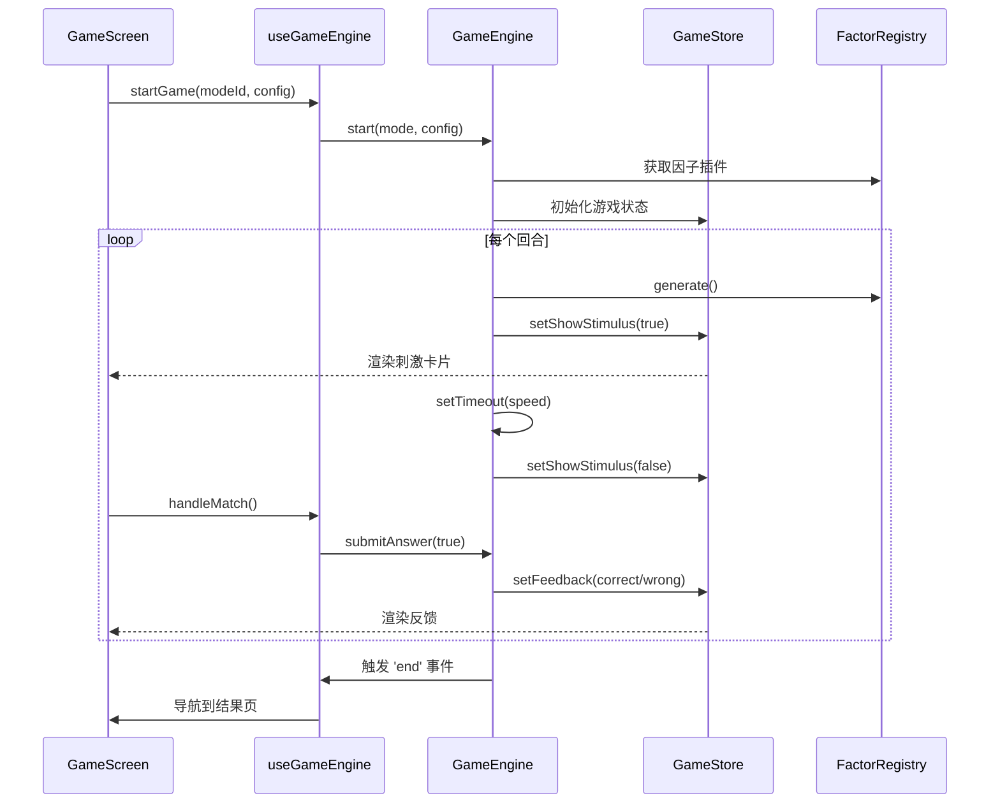

# 03 — 技术设计文档 (TDD)

> 版本: v2.0
> 更新: 2026-06-26

---

## 1. 技术栈

### 1.1 核心依赖

| 依赖 | 版本 | 用途 | 选型理由 |
|------|------|------|----------|
| react | ^19.2 | UI框架 | 团队熟悉，生态丰富 |
| react-dom | ^19.2 | DOM渲染 | 与React配套 |
| zustand | ^5.0 | 状态管理 | 轻量(1KB)、无Provider、TS友好 |
| react-router-dom | ^7.0 | 路由 | Hash路由兼容Capacitor |
| i18next | ^24.0 | 国际化 | 成熟稳定，支持命名空间/插值 |
| react-i18next | ^15.0 | React-i18n绑定 | 官方推荐 |
| lucide-react | ^0.562 | 图标库 | Tree-shaking，按需加载 |
| idb | ^8.0 | IndexedDB | 原生API封装，Promise风格 |
| idb-keyval | ^6.2 | KV存储 | 简单KV场景的IDB封装 |

### 1.2 开发依赖

| 依赖 | 版本 | 用途 |
|------|------|------|
| vite | ^7.2 | 构建工具 |
| @vitejs/plugin-react | ^5.1 | React Fast Refresh |
| typescript | ^5.7 | 类型检查 |
| tailwindcss | ^4.0 | 原子化CSS |
| @tailwindcss/typography | ^0.5 | 排版插件 |
| vitest | ^3.0 | 单元测试 |
| @testing-library/react | ^16.0 | 组件测试 |
| @testing-library/jest-dom | ^6.6 | DOM断言 |
| @capacitor/core | ^6.0 | 原生桥接(预装，v3.0启用) |
| @capacitor/cli | ^6.0 | Capacitor CLI |

### 1.3 未引入但预研的技术

| 技术 | 计划版本 | 用途 |
|------|----------|------|
| framer-motion | v2.1 | 复杂动画(按需引入) |
| vite-plugin-pwa | v3.0 | PWA Service Worker |
| @capacitor/share | v3.0 | 原生分享 |
| @capacitor/push-notifications | v3.0 | 推送通知 |
| sentry | v2.0 | 错误监控 |

---

## 2. 架构决策记录 (ADR)

### ADR-001: Hash路由而非History路由

- **决定**: 使用HashRouter
- **原因**: Capacitor WebView加载 `file://` 协议不支持BrowserRouter；PWA离线场景同理
- **影响**: URL格式为 `/#/menu` 而非 `/menu`

### ADR-002: Zustand而非Redux/Jotai

- **决定**: 使用Zustand
- **原因**: 本项目状态规模中等，不需要Redux的样板代码；Zustand的persist中间件天然支持localStorage/IDB
- **影响**: Store定义更简洁，无Provider嵌套

### ADR-003: IndexedDB而非localStorage做主存储

- **决定**: 游戏数据(会话记录)存IndexedDB，仅设置存localStorage
- **原因**: localStorage有5MB上限，IndexedDB通常50MB+，且支持索引查询
- **影响**: 引入idb/idb-keyval依赖，需实现降级方案

### ADR-004: 纯CSS动画(第一阶段)，framer-motion按需引入

- **决定**: v1.0-v1.2使用Tailwind + CSS动画，v2.1评估framer-motion
- **原因**: 当前动画需求简单，CSS足以胜任；framer-motion增加17KB gzip
- **影响**: 动画用Tailwind类名 + @keyframes实现

### ADR-005: 游戏引擎与UI分离

- **决定**: game engine不依赖React，通过事件或回调与UI通信
- **原因**: 方便单元测试，方便未来切换UI框架
- **影响**: engine/目录内禁止引入React/Jsx

### ADR-006: rAF GameLoop 替代 setTimeout

- **决定**: 使用 requestAnimationFrame 驱动的 GameLoop + PhaseMachine 管理回合时序
- **原因**: setTimeout 在后台标签页会被浏览器节流（最低1秒），导致游戏逻辑不同步；
          rAF 提供帧级精度，delta clamp 机制（>3000ms自动暂停）安全处理后台恢复
- **影响**: GameLoop.js + PhaseMachine.js 为 P0 必选，不再使用 setTimeout 做游戏时序（v5.0）

### ADR-007: PhaseMachine 四阶段模型

- **决定**: 每个 trial 拆分为 fadeIn → visible → fadeOut → gap 四个阶段
- **原因**: 刺激可见期与用户反应窗口重叠（而非刺激结束后才开始计时）；
          散步模式的等待输入（waitingForInput）灵活切换可见时长
- **影响**: 所有新游戏模式必须遵循此阶段模型

---

## 3. 分层架构

### 3.1 四层模型

```
┌─────────────────────────────────────────────────────┐
│  Layer 4: 展示层 (Presentation)                     │
│  screens/ + components/                             │
│  依赖: hooks/ + stores/                             │
├─────────────────────────────────────────────────────┤
│  Layer 3: 适配层 (Adapters)                         │
│  hooks/ (连接stores/services到UI)                    │
│  依赖: stores/ + services/                          │
├─────────────────────────────────────────────────────┤
│  Layer 2: 业务层 (Business)                         │
│  engine/ + factors/ + stores/                       │
│  依赖: services/                                    │
├─────────────────────────────────────────────────────┤
│  Layer 1: 基础层 (Infrastructure)                   │
│  services/ (音频/存储/国际化/平台/分享)               │
│  依赖: 第三方库 (idb, i18next, etc.)                 │
└─────────────────────────────────────────────────────┘
```

### 3.2 依赖规则 (铁律)

```
L4 → L3 → L2 → L1  ✅ 允许
L4 → L1             ❌ 禁止 (展示层不能跳过适配层直接调服务)
L1 → L4             ❌ 禁止 (基础设施层不能依赖展示层)
L2 → L4             ❌ 禁止 (业务层不能依赖展示层)
```

---

## 4. 数据流

### 4.1 游戏数据流



### 4.2 状态归属

| 状态 | Store | 持久化 | 说明 |
|------|-------|--------|------|
| 语言偏好 | UserStore | localStorage | 跨session |
| 静音设置 | SettingsStore | localStorage | 跨session |
| 难度选择 | SettingsStore | localStorage | 跨session |
| 游戏运行时 | GameStore | 不持久化 | 仅内存 |
| 高分记录 | StatsStore | IndexedDB | 跨session |
| 会话记录 | StatsStore | IndexedDB | 跨session |
| 成就 | StatsStore | IndexedDB | 跨session |

---

## 5. 状态管理详细设计

### 5.1 useGameStore (运行时，不持久化)

```typescript
interface GameState {
  // 状态枚举
  status: 'idle' | 'ready' | 'active' | 'paused' | 'finished' | 'abandoned';
  
  // 游戏配置
  mode: GameModeConfig | null;
  config: {
    n: number;
    speed: number;
    totalTurns: number;
    factorId: string;
  };
  
  // 运行时数据
  history: Factor[];
  currentTurn: number;
  score: number;
  showStimulus: boolean;
  userAnswered: boolean;
  feedback: 'correct' | 'wrong' | 'missed' | null;
  isWarmupPhase: boolean;
  
  // 暂停相关
  pausedAt: number | null;
  pauseElapsed: number;
  
  // 动作
  init: (mode: GameModeConfig, config: GameConfig) => void;
  nextTurn: (factor: Factor) => void;
  showStimulus: () => void;
  hideStimulus: () => void;
  submitAnswer: (isMatch: boolean) => AnswerResult;
  addScore: (points: number) => void;
  setFeedback: (type: FeedbackType) => void;
  pause: () => void;
  resume: () => void;
  finish: () => void;
  abandon: () => void;
  reset: () => void;
}
```

### 5.2 useStatsStore (IndexedDB持久化)

```typescript
interface StatsState {
  sessions: GameSession[];
  bestScores: Record<string, number>;
  achievements: Achievement[];
  
  addSession: (session: GameSession) => void;
  getHistory: (modeId?: string, limit?: number) => GameSession[];
  getBestScore: (modeId: string) => number;
  getAverageScore: (modeId: string, recent?: number) => number;
  getAccuracy: (modeId: string) => number;
  getStreak: () => number;
  checkAchievement: (type: string) => Achievement | null;
  exportData: () => Promise<Blob>;
  importData: (json: string) => Promise<void>;
}
```

---

## 6. 存储策略

### 6.1 三层存储

```
┌──────────────────────────────────────────┐
│ L1: 内存 (Zustand)                       │
│ 用途: 游戏运行时状态                      │
│ 容量: 受浏览器标签页内存限制              │
│ 生命周期: 标签页关闭即清空                │
├──────────────────────────────────────────┤
│ L2: localStorage                        │
│ 用途: 用户偏好 (语言/静音/难度)          │
│ 容量: 5-10MB                             │
│ 持久化: Zustand persist middleware       │
├──────────────────────────────────────────┤
│ L3: IndexedDB                           │
│ 用途: 游戏会话、统计数据、成就            │
│ 容量: 通常 ≥50MB (浏览器配额)            │
│ 封装: idb + idb-keyval                  │
│ 降级: IDB不可用时 → localStorage → 内存  │
└──────────────────────────────────────────┘
```

### 6.2 数据迁移

```javascript
// StorageService.migrate(fromVersion, toVersion)
// 迁移链: v0 → v1.0 → v1.1 → v2.0 → v3.0

const migrations = {
  'v0→v1.0': (oldData) => {
    // localStorage: { [levelIndex]: bestScore }
    // → IndexedDB: { [modeId]: { best: score, sessions: [] } }
    const newData = {};
    Object.entries(oldData).forEach(([idx, score]) => {
      const modeId = `standard-n${parseInt(idx) + 1}`;
      newData[modeId] = { best: score, sessions: [] };
    });
    return newData;
  },
};
```

---

## 7. 音频系统

### 7.1 AudioService 设计

```typescript
class AudioService {
  private ctx: AudioContext | null;
  private bgmNodes: AudioNode[];
  
  // 生命周期
  init(): void;       // 懒初始化 AudioContext
  resume(): void;     // 从suspended恢复
  destroy(): void;    // 清理所有节点
  
  // 音效
  playChime(): void;  // 正确音效 (五声音阶)
  playWood(): void;   // 错误音效 (低音)
  
  // 环境音
  startAmbience(): void;   // 背景白噪声
  stopAmbience(): void;
  
  // 听觉因子
  playTone(frequency: number, duration: number): void;
  playWord(audioBuffer: AudioBuffer): void;
  
  // 控制
  toggleMute(): boolean;
  get isMuted(): boolean;
}
```

### 7.2 自动播放策略

```javascript
// 浏览器自动播放限制处理
async function ensureAudioContext() {
  if (!audioService.ctx) {
    audioService.init();
  }
  if (audioService.ctx.state === 'suspended') {
    // 等待用户交互恢复
    await audioService.ctx.resume();
  }
}
```

---

## 8. 平台服务

### 8.1 PlatformService

```typescript
interface PlatformInfo {
  os: 'ios' | 'android' | 'windows' | 'macos' | 'linux' | 'unknown';
  isTouch: boolean;
  isMobile: boolean;
  isTablet: boolean;
  isDesktop: boolean;
  isPWA: boolean;
}

class PlatformService {
  static detect(): PlatformInfo;
  static isCapacitor(): boolean;
  static share(data: ShareData): Promise<void>;
  static vibrate(duration: number): void;
}
```

### 8.2 触摸适配

```typescript
// hooks/usePlatform.ts
export function useTouchSize() {
  const { isTouch } = usePlatform();
  return {
    minSize: isTouch ? '44px' : '36px',
    padding: isTouch ? '16px 24px' : '12px 20px',
  };
}
```

---

## 9. 测试策略

### 9.1 测试金字塔

```
        ┌─────┐
        │ E2E │  关键用户流程 (v2.0+)
       ┌┴─────┴┐
       │ 集成  │  GameEngine + Factor + Store 协作 (v1.2+)
      ┌┴───────┴┐
      │ 单元测试 │  所有 engine/ services/ stores/ hooks/ (v1.0+)
     └──────────┘
```

### 9.2 测试覆盖目标

| 模块 | v1.0 | v2.0 | v3.0 |
|------|------|------|------|
| engine/ | 80% | 90% | 90% |
| services/ | 70% | 80% | 85% |
| stores/ | 70% | 80% | 85% |
| hooks/ | 60% | 70% | 80% |
| components/ | 40% | 50% | 60% |

### 9.3 CI检查

```yaml
# .github/workflows/ci.yml
jobs:
  lint:     # ESLint + TypeScript
  test:     # Vitest + coverage
  build:    # Vite build
  analyze:  # Bundle size check (gzip < 200KB)
```
